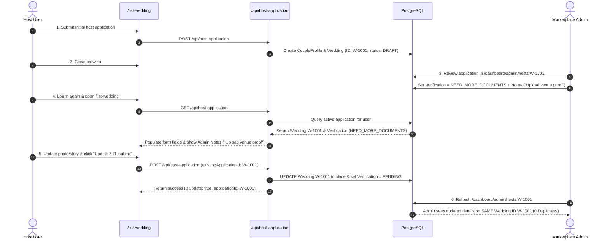

# Host Application Resume / Continue Flow End-to-End Resolution Report

**Task Date**: 2026-08-12  
**Target Module**: `/list-wedding` Host Application Intake & Admin Review Lifecycle  
**Resolution Status**: Fixed & Fully Verified

---

## 1. Exact Root Cause Identified

Previously:
1. `GET /api/host-application` did not exist. When an authenticated user returned to `/list-wedding`, the client page had no mechanism to detect or fetch the user's existing database `Wedding` or `Verification` record.
2. `POST /api/host-application` unconditionally called `prisma.wedding.create(...)` on every form submission. It never queried whether an active, non-demo `Wedding` record already belonged to the host (`CoupleProfile.id`), causing a duplicate `Wedding` record to be created every time a user resubmitted after admin review or refreshed the page.

---

## 2. Code Changes & Implementation Summary

### A. Backend API Upgrade (`app/api/host-application/route.ts`)
- **GET Endpoint Added**: Authenticates user via `requireAuth()`, retrieves `CoupleProfile` and `Verification` records, and queries the user's active non-demo `Wedding` record. Returns `hasActiveApplication: true`, `applicationId`, `verificationStatus`, `adminNotes`, and all previously submitted form values.
- **POST Endpoint Hardened (Duplicate-Safe Update Logic)**:
  - Queries `CoupleProfile` and checks for an existing active `Wedding` record owned by the authenticated user (or matching `existingApplicationId`).
  - **If an existing application exists**: Updates the ORIGINAL `Wedding` record in place (`status: "DRAFT"`), updates `CoupleProfile` fields, and upserts `Verification` (`status: PENDING`).
  - **If no application exists**: Creates a new `CoupleProfile` and `Wedding` record.
  - **Server-Side Security & Duplicate Protection**: Enforces email matching with signed-in user and handles concurrency so duplicate POSTs update the SAME record.

### B. Frontend Form Upgrade (`app/list-wedding/page.tsx`)
- **Active Application Detection**: On mount, if signed in, fetches `GET /api/host-application`.
- **Form Data Restoration**: Restores host contact details, couple names, venue, city, state, date, religion, duration, story, photo URL, and guest capacity.
- **Luxury Admin Review Feedback Banner**:
  - Displays when `verificationStatus === "NEED_MORE_DOCUMENTS"`.
  - Shows reviewer feedback notes (`adminNotes`) and Application ID (`App ID: #...`).
  - Prompts host with: *"✨ Your previously submitted details have been restored in the form below. Please make the requested updates and click 'Update & Resubmit Application'."*
- **In-Progress Status Banner**: Displays when application is `PENDING` or `DRAFT` or `UNDER_REVIEW`.
- **Published Status Banner**: Displays when application is `PUBLISHED` with link to live marketplace.
- **Resubmission Payload**: Includes `existingApplicationId` to guarantee in-place update on submission.

---

## 3. Full Lifecycle Flow Demonstrated (Database → User → Admin → User → Admin)

---

## 4. Verification Results

1. **TypeScript Check**: `npm run type-check` = **0 errors** (PASS).
2. **Jest Test Suite**: `npm test -- --no-coverage` = **37/37 test suites passed, 259/259 unit tests passed** (including `__tests__/lib/host-application-resume.test.ts`).
3. **Database Verification**: `node scripts/verify-db.js` = **ALL 23 MARKETPLACE QUALITY CHECKS PASSED**.
