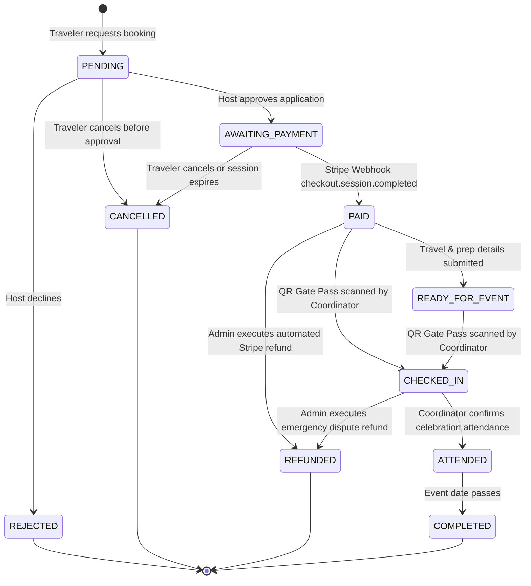
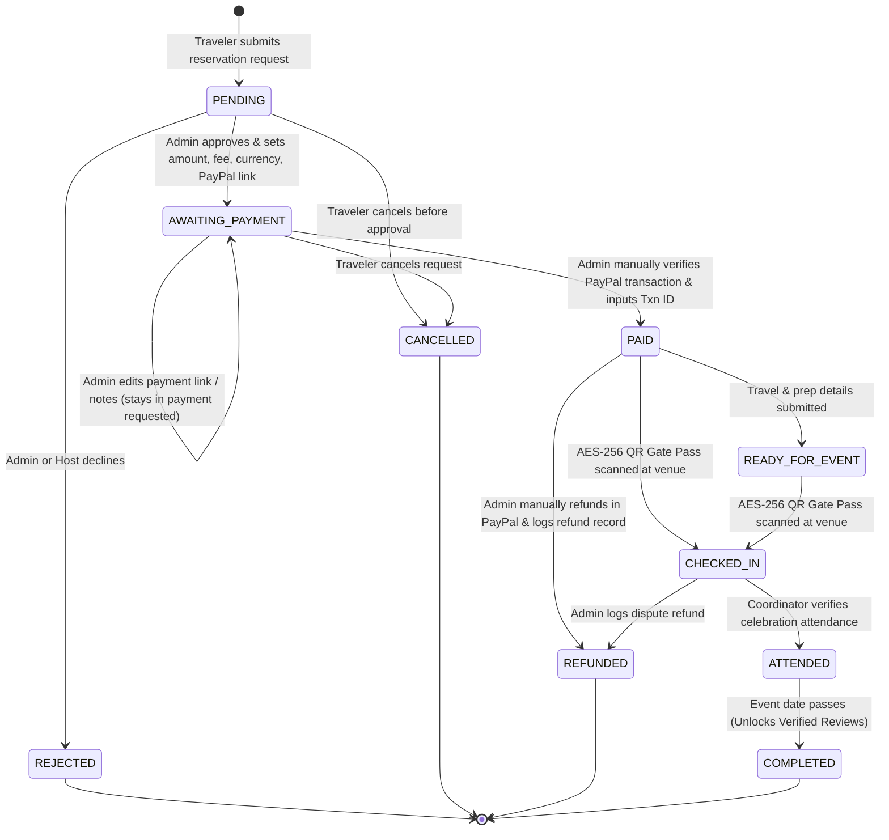

# BOOKING STATE MACHINE BEFORE & AFTER MANUAL PAYPAL MIGRATION

**Document Version:** 1.0.0  
**Date:** 2026-08-18  
**Context:** WeddingWithIndia Booking & Financial State Architecture

---

## 1. Actual Existing Booking Enums in PostgreSQL

The authoritative `BookingStatus` enum defined in `prisma/schema.prisma` contains the following 13 values:

```prisma
enum BookingStatus {
  PENDING
  APPROVED
  REJECTED
  AWAITING_PAYMENT
  PAID
  CONFIRMED
  READY_FOR_EVENT
  CHECKED_IN
  ATTENDED
  COMPLETED
  CANCELLED
  REFUNDED
  NO_SHOW
}
```

### Existing State Groupings (from `lib/booking-statuses.ts`)

- **Capacity-Holding Statuses** (reserving spots from `Wedding.capacity`):
  `AWAITING_PAYMENT`, `APPROVED`, `PAID`, `CONFIRMED`, `READY_FOR_EVENT`, `CHECKED_IN`, `ATTENDED`, `COMPLETED`
- **Active Reservation Statuses** (preventing duplicate bookings by the same traveler):
  `PENDING`, `AWAITING_PAYMENT`, `APPROVED`, `PAID`, `CONFIRMED`, `READY_FOR_EVENT`, `CHECKED_IN`, `ATTENDED`, `COMPLETED`

---

## 2. Real-World Lifecycle Comparison

### 2.1 Pre-Migration (Stripe-Coupled) Lifecycle



### 2.2 Post-Migration (Manual PayPal MVP) Lifecycle



---

## 3. Detailed Transition Matrix for Manual PayPal MVP

| Initial State | Trigger / Action | Actor | Target State | Atomic Side Effects |
| :--- | :--- | :--- | :--- | :--- |
| `[INIT]` | `createBookingAction` | Traveler | `PENDING` | Calculates server-authoritative base pricing; locks wedding row (`SELECT FOR UPDATE`); checks capacity; notifies host and admin. |
| `PENDING` | `handleGuestApplicationAction("rejected")` or `adminRejectBookingAction` | Host / Admin | `REJECTED` | Releases held spot; notifies traveler of decline; non-blocking email dispatch. |
| `PENDING` | `cancelBookingAction` | Traveler | `CANCELLED` | Releases spot; logs cancellation request. |
| `PENDING` | `requestPaymentAction` | Admin | `AWAITING_PAYMENT` | Validates PayPal URL; stores `baseAmount`, `processingFeePercent`, `processingFeeAmount`, `totalAmount`, `currency`, `paymentLink`, `paymentNotes`; creates/updates `Payment` record; dispatches `PAYMENT_REQUIRED` notification & email to traveler. |
| `AWAITING_PAYMENT` | `updatePaymentRequestAction` | Admin | `AWAITING_PAYMENT` | Updates payment amount, fee, or PayPal URL before payment verification. Logs audit entry. |
| `AWAITING_PAYMENT` | `cancelBookingAction` | Traveler | `CANCELLED` | Releases held spot; notifies host and admin. |
| `AWAITING_PAYMENT` | `markPaymentPaidAction` | Admin | `PAID` | Validates transaction ID; updates `Payment.status = PAID`, `paidAt = now()`; creates `Transaction` ledger entry; generates `GuestPass` (AES-256 encrypted token + SHA-256 hash) **idempotently**; creates `TravelerPreparation`; generates `Commission` for referring agent (14-day hold); notifies traveler and host; dispatches confirmation email. |
| `PAID` | `saveTravelDetailsAction` | Traveler | `READY_FOR_EVENT` | Stores traveler flight/hotel/emergency details. |
| `PAID` or `READY_FOR_EVENT` | `checkInGuestAction` | Coordinator | `CHECKED_IN` | Validates AES-256 token against QR hash; verifies coordinator assigned wedding; atomically marks pass `CHECKED_IN` (prevents double check-in). |
| `CHECKED_IN` | `markAttendanceAction` | Coordinator | `ATTENDED` | Confirms full ceremony presence; unlocks review eligibility. |
| `ATTENDED` | Event Date Passes | System | `COMPLETED` | Marks celebration complete. |
| `PAID` / `CHECKED_IN` | `recordManualRefundAction` | Admin | `REFUNDED` | Admin enters manual PayPal refund transaction reference & notes; updates `Payment.status = REFUNDED`, `Booking.status = REFUNDED`; creates `Refund` and `Transaction(type: REFUND)` records; reverses un-matured agent commission; sends refund confirmation email. |

---

## 4. Key Invariants & Non-Regressions

1. **Reusing `AWAITING_PAYMENT`**: `AWAITING_PAYMENT` represents the "Payment Requested" state where the traveler has been approved and presented with payment terms. No new duplicate enum is required.
2. **Reusing `PAID`**: `PAID` represents the confirmed booking with valid ticket/pass. All existing dashboards, event hubs, and coordinator gate scanners recognize `PAID` as confirmed.
3. **Idempotency Guarantee**: If Admin clicks **Mark as Paid** multiple times, `markPaymentPaidAction` executes inside a serial transaction:
   - If `Payment.status === "PAID"`, it immediately returns the existing payment record without creating duplicate `GuestPass`, `Commission`, `Transaction`, or `Notification` rows.
4. **Zero-Dollar Promo Coupon Bypass**: Fully maintained within the provider-agnostic payment architecture. If a 100% coupon is applied (`totalAmount === 0`), the pass is confirmed directly with a mock transaction code.
