# STRIPE FORENSIC DEPENDENCY AUDIT

**Audit Date:** 2026-08-18  
**Scope:** Complete repository scan for active and historical Stripe dependencies across source code, database schema, APIs, server actions, background jobs, client components, environment configurations, and tests.

---

## 1. Executive Summary

This forensic audit maps all Stripe dependencies in the WeddingWithIndia codebase prior to the manual PayPal payment migration. The goal is to remove Stripe as an **active payment provider** while preserving historical financial records, maintaining database integrity, and transitioning booking confirmation to an internal, provider-agnostic manual PayPal workflow.

---

## 2. Complete Inventory of Stripe Dependencies

### 2.1 File & Module Dependencies

| File Path | Type | Purpose | Direct Imports / Exports |
| :--- | :--- | :--- | :--- |
| `lib/stripe.ts` | Core Library | Stripe SDK singleton initialization | Imports `Stripe` from `"stripe"`, `env` from `"./env"`. Exports `stripe`, `getStripe()`, `PAYMENT_EXPIRY_MINUTES`. |
| `lib/env.ts` | Configuration | Environment variable schema & validation | Validates `STRIPE_SECRET_KEY`, `STRIPE_WEBHOOK_SECRET`. |
| `package.json` | Manifest | Package dependencies | `"stripe": "^22.3.1"` in dependencies. |
| `app/api/webhooks/stripe/route.ts` | API Route | Stripe webhook HTTP listener | Constructs events with `stripe.webhooks.constructEvent`, processes `checkout.session.completed`, `payment_intent.payment_failed`, `charge.dispute.created`, `charge.refunded`. |
| `app/api/ready/route.ts` | Health Check | Readiness probe | Calls `stripe.balance.retrieve()` to assert external provider availability. |
| `app/api/invoice/[bookingId]/route.ts` | API Route | HTML Invoice Generator | Reads `payment.stripePaymentIntentId` as transaction reference. |
| `lib/actions/stripe.ts` | Server Action | Stripe-specific mutation actions | Exports `createStripeCheckoutAction`, `processFullRefundAction`, `processPartialRefundAction`, `retryStripeWebhookEventAction`. |
| `lib/actions/index.ts` | Server Action | Core application actions | Exports `createCheckoutSessionAction`, `refundBookingAction` (calls `stripe.refunds.create`). |
| `lib/actions/admin.ts` | Server Action | Admin mutations | `adminPayoutWeddingAction` (calls `stripe.transfers.create`), `adminGetSystemMetricsAction` (computes `stripeStats`), `adminGetPaymentsAndQueuesAction` (queries `stripeWebhookEvent`). |
| `lib/services/refunds.ts` | Service | Refund domain logic | Calls `stripe.refunds.create`, exports `handleStripeRefundSucceeded`, `handleStripeRefundFailed`. |
| `lib/actions/referrals.ts` | Server Action | Agent affiliate tracking | `payoutMethodSchema` contains enum `STRIPE_CONNECT`. |
| `context/AuthContext.tsx` | React Context | Frontend client state | Contains `checkoutBooking` calling `createCheckoutSessionAction`. |
| `components/dashboard/BookingCard.tsx` | React Component | Traveler booking card | "Pay Now" button triggers `checkoutBooking` and redirects to Stripe; Invoice section renders `stripeChargeId`. |
| `components/dashboard/AdminStripeAuditManager.tsx` | React Component | Admin Stripe tool | Form for full/partial Stripe refunds and webhook event retries. |
| `app/dashboard/admin/payments/page.tsx` | Next.js Page | Admin payments dashboard | Renders `AdminStripeAuditManager`, payout queue with `stripeTransferId`. |
| `app/dashboard/admin/bookings/page.tsx` | Next.js Page | Admin booking manager | Form calling `refundBookingAction`. |
| `prisma/schema.prisma` | DB Schema | PostgreSQL Data Model | Contains Stripe-specific fields and models (`Payment.stripePaymentIntentId`, `Payment.stripeChargeId`, `Refund.stripeRefundId`, `Payout.stripeTransferId`, `PaymentIntent`, `StripeWebhookEvent`, `CoupleProfile.stripeAccountId`, `AgentProfile.stripeAccountId`). |
| `.env`, `.env.example`, `.env.test` | Environment | Environment variables | Contains `STRIPE_SECRET_KEY`, `STRIPE_WEBHOOK_SECRET`, `NEXT_PUBLIC_STRIPE_PUBLISHABLE_KEY`. |
| `scripts/validators/env.js` | Dev Script | Env validator script | Validates Stripe keys. |
| `scripts/seed-complete.js` | Dev Script | Database seed script | Populates mock Stripe IDs in `Payment`, `Refund`, and `Payout`. |
| `e2e/financial-integrity.spec.ts` | E2E Test | Playwright test | Tests `createStripeCheckoutAction`. |
| `__tests__/lib/*.test.ts` | Unit Tests | Jest test suites | 10 test suites mock or test Stripe logic (`admin-payments.test.ts`, `adversarial-production-verification.test.ts`, `m1-m4-hardening.test.ts`, `m2-challenger-verification.test.ts`, etc.). |

---

## 3. Deep-Dive Dependency Analysis

### 1. `lib/stripe.ts`
- **Function:** `getStripe()`, `stripe` Proxy, `PAYMENT_EXPIRY_MINUTES`.
- **Current Purpose:** Initializes and exports the official Stripe SDK client instance using `STRIPE_SECRET_KEY`.
- **Called By:** `lib/actions/stripe.ts`, `lib/actions/index.ts`, `lib/actions/admin.ts`, `lib/services/refunds.ts`, `app/api/webhooks/stripe/route.ts`, `app/api/ready/route.ts`.
- **Database Impact:** None directly (network client).
- **User Impact:** Indirectly creates Stripe Checkout sessions.
- **Admin Impact:** Indirectly executes Stripe refunds and transfers.
- **What Replaces It:** Removed completely. Replaced by internal payment service (`lib/services/payments.ts` and `lib/actions/payment-manual.ts`).

### 2. `app/api/webhooks/stripe/route.ts`
- **Function:** `POST(req: Request)`
- **Current Purpose:** Receives Stripe HTTP webhook payloads, verifies `stripe-signature` with `STRIPE_WEBHOOK_SECRET`, deduplicates via `StripeWebhookEvent`, transitions `Booking` to `PAID`, generates `GuestPass` (AES-256), creates `Payment` & `Transaction`, creates `TravelerPreparation`, triggers referral commission, and sends customer invoice email.
- **Called By:** External Stripe webhook dispatchers.
- **Database Impact:** Writes `Payment`, `PaymentIntent`, `Transaction`, `GuestPass`, `TravelerPreparation`, `Notification`, `Commission`, and updates `Booking.status = "PAID"`.
- **User Impact:** The single event that transitions guest from unpaid reservation to confirmed attendee with ticket.
- **Admin Impact:** Updates financial logs.
- **What Replaces It:** Removed completely. Downstream business triggers (Booking status -> `PAID`, `GuestPass` creation, `Notification`, `Commission`) are moved to the internal, atomic `markPaymentPaidAction` executed manually by the Admin after verifying the PayPal transaction.

### 3. `lib/actions/index.ts` -> `createCheckoutSessionAction`
- **Function:** `createCheckoutSessionAction(bookingId: string)`
- **Current Purpose:** Validates traveler booking, asserts `AWAITING_PAYMENT`, calls `stripe.checkout.sessions.create` with USD amount, returns Stripe hosted checkout URL.
- **Called By:** `context/AuthContext.tsx` -> `checkoutBooking(bookingId)`.
- **Database Impact:** Reads `Booking`, `Payment`.
- **User Impact:** Directs customer to Stripe checkout page.
- **Admin Impact:** None directly.
- **What Replaces It:** Replaced by `requestPaymentAction` (Admin sets payment link/amount) and `getPaymentDetailsAction` (Traveler views PayPal payment request link and instructions in dashboard).

### 4. `lib/actions/index.ts` -> `refundBookingAction`
- **Function:** `refundBookingAction(bookingId: string)`
- **Current Purpose:** Authorizes Admin, fetches paid `Payment`, calls `stripe.refunds.create({ payment_intent })`, creates `Refund` record, updates `Payment.status = REFUNDED`, `Booking.status = REFUNDED`, creates `Transaction` ledger entry, and sends refund email.
- **Called By:** `app/dashboard/admin/bookings/page.tsx` quick refund form, `context/AuthContext.tsx`.
- **Database Impact:** Creates `Refund`, `Transaction`, updates `Payment` and `Booking`.
- **User Impact:** Refunds card payment.
- **Admin Impact:** Admin initiates refund.
- **What Replaces It:** Replaced by `recordManualRefundAction` where Admin records manual refund details (transaction ID, refund amount, notes) after processing the refund manually inside PayPal.

### 5. `lib/actions/admin.ts` -> `adminPayoutWeddingAction`
- **Function:** `adminPayoutWeddingAction(paymentId: string)`
- **Current Purpose:** Calls `stripe.transfers.create` to send funds to host's `stripeAccountId`.
- **Called By:** Admin payout button.
- **Database Impact:** Creates `Payout` with `stripeTransferId`.
- **User / Host Impact:** Transferred money to host Stripe account.
- **Admin Impact:** Automated payout.
- **What Replaces It:** Replaced by manual host payout recording (`adminRecordHostPayoutAction`) without external Stripe transfers.

### 6. `lib/services/refunds.ts` -> `processApprovedRefund`
- **Function:** `processApprovedRefund(cancellationRequestId: string, adminUserId: string)`
- **Current Purpose:** Initiates async refund via `stripe.refunds.create` with idempotency key, waits for webhook.
- **Called By:** `cancelBookingAction` when auto-approved.
- **Database Impact:** Creates `Refund(status: PENDING)`, updates `CancellationRequest(status: PROCESSING)`.
- **What Replaces It:** Provider-agnostic manual refund recording.

### 7. `app/api/ready/route.ts`
- **Function:** `GET()`
- **Current Purpose:** Asserts Stripe API health by calling `stripe.balance.retrieve()`.
- **Called By:** Docker / Kubernetes / uptime probes.
- **Database Impact:** None.
- **What Replaces It:** Stripe check removed; probe checks PostgreSQL DB connection health only.

### 8. `components/dashboard/AdminStripeAuditManager.tsx`
- **Function:** React UI component for Stripe refunds and webhook retries.
- **Current Purpose:** Renders Webhook event audit queue and modal to trigger `processFullRefundAction` / `processPartialRefundAction`.
- **Called By:** `app/dashboard/admin/payments/page.tsx`.
- **What Replaces It:** Replaced by `components/dashboard/AdminManualPaymentManager.tsx` with full manual PayPal payment request, verification, transaction ID entry, and manual refund controls.

---

## 4. Database Fields & Models Matrix

| Model | Field / Model | Disposition in Migration | Rationale |
| :--- | :--- | :--- | :--- |
| `Payment` | `stripePaymentIntentId` | **Preserved (Nullable)** | Historical records retain existing Stripe IDs for financial auditability. |
| `Payment` | `stripeChargeId` | **Preserved (Nullable)** | Historical records retain existing charge IDs. |
| `Payment` | *New fields* | **Added** | `provider`, `baseAmount`, `processingFeePercent`, `processingFeeAmount`, `totalAmount`, `paymentLink`, `transactionId`, `paymentNotes`, `paymentRequestedAt`, `paidAt`, `refundStatus`, `refundedAt`, `refundNotes`, `refundTransactionId`. |
| `Refund` | `stripeRefundId` | **Preserved (Nullable)** | Preserves historical Stripe refund references. |
| `Payout` | `stripeTransferId` | **Preserved (Nullable)** | Preserves historical Stripe payout references. |
| `PaymentIntent` | Model | **Deprecated / Preserved** | Retained in schema for historical relations, not used for new manual payments. |
| `StripeWebhookEvent` | Model | **Deprecated / Preserved** | Retained in schema for historical audit trail. |
| `CoupleProfile` | `stripeAccountId`, `stripeOnboardingComplete` | **Preserved (Nullable)** | Safe non-breaking retention. |
| `AgentProfile` | `stripeAccountId`, `stripeOnboardingComplete` | **Preserved (Nullable)** | Safe non-breaking retention. |
| `SystemConfig` | *New fields* | **Added** | `paypalProcessingFeePercent`, `paypalProcessingFeeFixedAmount`, `paypalDomainAllowlist`. |

---

## 5. Downstream Flow Decoupling Plan

```mermaid
graph TD
    subgraph OLD_FLOW [Old Stripe Architecture]
        O1[Traveler Booking PENDING] --> O2[Host Approves AWAITING_PAYMENT]
        O2 --> O3[Stripe Checkout Session Created]
        O3 --> O4[Customer Pays via Stripe Card Form]
        O4 --> O5[Stripe Webhook checkout.session.completed]
        O5 --> O6[Booking -> PAID]
        O5 --> O7[Generate GuestPass AES-256]
        O5 --> O8[Generate Agent Commission]
        O5 --> O9[Send Invoice Email]
    end

    subgraph NEW_FLOW [New Manual PayPal MVP Architecture]
        N1[Traveler Booking PENDING] --> N2[Admin/Host Approves Booking]
        N2 --> N3[Admin Sets Amount, Fee %, Currency, PayPal Link]
        N3 --> N4[Status -> AWAITING_PAYMENT / PAYMENT_REQUESTED]
        N4 --> N5[Traveler Opens External PayPal Link]
        N5 --> N6[Traveler Pays Outside Platform]
        N6 --> N7[Admin Verifies in PayPal & Inputs Txn ID]
        N7 --> N8[Admin Clicks MARK PAID Atomic Action]
        N8 --> N9[Booking -> PAID / CONFIRMED]
        N8 --> N10[Generate GuestPass AES-256 Idempotent]
        N8 --> N11[Generate Agent Commission Idempotent]
        N8 --> N12[Send Payment Confirmation Notification & Email]
    end
```

---

## 6. Audit Conclusion & Readiness

The Stripe dependency audit is complete. All 21 impacted files across source code, database schema, APIs, server actions, components, and tests have been cataloged with precise replacement mappings. No production code has been modified during this audit phase.
